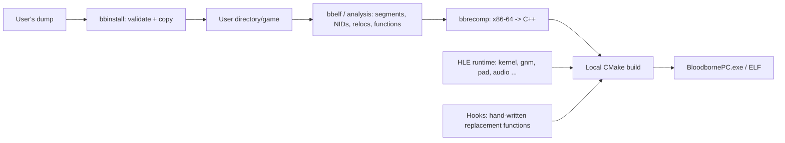

# Architecture

Goal: native PC port of Bloodborne 1.09 (+ The Old Hunters). The user's `eboot.bin` is **locally** statically
recompiled into C++; all PS4 system libraries are replaced by host implementations (HLE).
Model: [Dusklight](https://github.com/TwilitRealm/dusklight) (decomp + Aurora compatibility layer);
recompilation concepts from [N64Recomp](https://github.com/N64Recomp/N64Recomp) and
[XenonRecomp](https://github.com/hedge-dev/XenonRecomp); HLE and GCN knowledge from
[shadPS4](https://github.com/shadps4-emu/shadPS4).

## License

**GPL-3.0-or-later.** Rationale: shadPS4 (GPL-2.0-or-later) is by far the most valuable code reference
(HLE, PM4, GCN→SPIR-V). Under GPLv3 we may take code from it. MIT would be more permissive for users, but would rule out every
code taken from shadPS4. MIT- and Apache-2.0 dependencies (N64Recomp, XenonRecomp, LibAtrac9, SDL3, Remill,
[Zydis](https://github.com/zyantific/zydis) – already integrated, v4.1.1 via CMake FetchContent) are GPLv3-compatible.

## Data flow



## Directory layout

`[x]` = exists, `[ ]` = planned (created with the respective milestone, not before).

```
BloodbornePC/
├── CMakeLists.txt                 [x]
├── LICENSE                        [x] GPL-3.0
├── .github/workflows/ci.yml       [x] Windows (MSVC) + Linux (Clang)
├── docs/                          [x] Architecture, Roadmap
├── manifests/                     [x] SHA-256 manifests (hashes only, no contents)
├── src/
│   ├── core/                      [x] shared library bbcore
│   │   ├── hash.*                     SHA-1 (NIDs), SHA-256 (validation)
│   │   ├── nid.*                      NID generation/decoding
│   │   ├── sfo.*                      PARAM.SFO
│   │   ├── orbis_elf.*                ELF/fSELF: segments, dynamic, modules, libs, symbols, relocs
│   │   └── dump.*                     structure/hash check, install path
│   ├── recomp/                    [ ] M0/M1: disassembler binding, function finder, C++ emitter
│   ├── runtime/                   [ ] M1: guest memory, CPU context, TLS, loader for recompiled code
│   ├── hle/                       [ ] M1+: one file per PS4 library
│   │   ├── kernel/                    threads, sync, memory, time, filesystem (/app0 → game/)
│   │   ├── gnm/  videoout/            M2: Vulkan backend
│   │   ├── pad/  audio/  ajm/         M3: SDL3, LibAtrac9
│   │   └── savedata/ trophy/ user/ np/
│   ├── renderer/                  [ ] M2: Vulkan, GCN→SPIR-V, pipeline cache, detiling
│   ├── hooks/                     [ ] M1+: hand-written replacement functions (frame timing, camera, HUD)
│   └── app/                       [ ] M1: main, config, ImGui overlay
├── tools/
│   ├── bbinstall/                 [x] validate | hash | install
│   ├── bbelf/                     [x] ELF analysis
│   ├── bbrecomp/                  [ ] M1
│   └── ghidra/                    [ ] M0: headless scripts (import of the bbelf CSV, function lists)
├── tests/                         [x] synthetic fixtures, known-answer tests
└── build/ (gitignored)                generated code goes to build/generated, never in the repo
```

## Components

### Installer (`bbinstall`)
- Input: **unpacked** application folder with installed update 1.09 (`eboot.bin`, `sce_sys/param.sfo`,
  `dvdroot_ps4/`), optional DLC folder; or the unpacked 01.00 base together with the unpacked 1.09 update folder (`--update`), which
  the installer merges (update files replace base files at the same paths; validated virtually against the 1.09 manifest, then
  installed as one tree).
- Checks: `param.sfo` (TITLE_ID ∈ known Bloodborne IDs, `CATEGORY` `gd` or `gp` (merged dump carries
  the SFO of the update), `APP_VER=01.09`), `eboot.bin` is ELF or unencrypted fSELF, data folder (warning only,
  layout unconfirmed), DLC `CATEGORY=ac` with matching TITLE_ID, optional SHA-256 manifest (authoritative for
  completeness).
- **The installer and the launcher never decrypt PKGs.** The PFS content of a PS4 PKG is encrypted; opening it requires keys
  or decryption, and the project rules rule both out (no keys, no decryption code in the repository). The launcher can drive an
  **external extractor that the user supplies and configures** (argv template with `{pkg}` and `{out}`, no shell): it reads only
  the plain PKG header (content id, title id) for sanity checks, runs the tool into a work folder owned by the launcher, and
  validates the result against the manifests like any other dump.
- Target directory: `%APPDATA%\BloodbornePC` or `$XDG_DATA_HOME/BloodbornePC`; subfolders `game/`, `dlc/`, `mods/`
  (override folders with the same structure as `game/`).

### Code pipeline
Host and guest are both x86-64. This yields three options:

| Option | Pros | Cons |
|---|---|---|
| **A: x86-64 → C++ (XenonRecomp style)** | portable, debuggable, hooks trivial (function = C++ function) | huge amount of code (compile time), flags/SIMD must be reproduced exactly |
| B: Lifting to LLVM IR (Remill) | mature semantics, LLVM optimizes | Remill IR is hard to read, hooks/debugging more cumbersome, large dependency |
| C: Load original code natively and patch it (shadPS4 way) | fastest route to boot | exactly the emulator/loader approach the project rules out; `fs` TLS and SysV ABI clash under Windows |

**Decision: A**, with Remill (B) as the reference for the semantics of difficult instructions. Core of the design:
- Guest state lives in a `Context` struct (16 GPRs, RFLAGS bits, 16 YMM, `fs_base`). Each guest function becomes
  `void f_<vaddr>(Context&)`. As a result, the SysV/MS ABI question plays no role in game code; only
  HLE boundaries translate between `Context` and C++ signatures (code generator, not runtime thunks).
- Guest addresses stay valid: guest address = link vaddr + load bias (`kLoadBias`, fixed at recompile time; the eboot
  is linked at vaddr 0 and gets `0x400000`, as on the PS4 and in the community patches). The plan is
  identity mapping: the guest address space is reserved at the same host addresses (`Context::base = 0`), so that
  guest pointers are directly host pointers. The emitter already translates `fs:` accesses to `c.fs_base + …`; the TLS setup
  (`fs_base` per thread to the TCB) is still open (M1.2).
- Indirect jumps/calls go through a lookup table vaddr → function; jump tables are resolved statically.
- Imports (`JUMP_SLOT`/`GLOB_DAT` from `bbelf`) are bound directly to HLE functions.
- Hooks: a table vaddr → hand-written function replaces the generated function during codegen.

### HLE / Renderer
See roadmap. The renderer intercepts at the **Gnm level** (`sceGnmSubmitCommandBuffers`, `sceGnmDraw*`, …) and parses the
PM4 packets of the command buffers itself. The Gnm driver library only writes PM4, so there is no
"generic command processor" in the emulator sense. Shaders: GCN bytecode → SPIR-V (concept and code base from
shadPS4's `shader_recompiler`), persistent pipeline cache.

## Known facts about Bloodborne 1.09 (from community patches)
Source: [illusion0001/console-game-patches, Bloodborne-Orbis.yml](https://github.com/illusion0001/console-game-patches/blob/main/_patch0/orbis/Bloodborne-Orbis.yml)
(60-FPS diff by [Lance McDonald](https://www.patreon.com/posts/47314774)).
- Title IDs with 1.09: CUSA00900 (US), CUSA00207 (EU), CUSA03173, CUSA00208, CUSA01363.
- Frame-time constant 1/30 s at `0x02434883` (patch sets 1/60); flip rate via `sceVideoOutSetFlipRate` near `0x02ad61df`.
- Global at `0x059404f8`, field `+0x264`: according to the patch, a physics delta time that is used at several places
  (`0x01bf9ca9`, `0x021bc181`, `0x02377cec`, `0x02418e3d`) taken into game logic. These are direct starting points
  for M5 (frame unlock).
- Render target size as data at `0x055289f8/…fc` (1920×1080); crosshair scaling hard-coded to 1920×1080 at
  `0x01a44c55`, `0x01a452c7`.
- Chromatic aberration `0x0269faa8`, motion blur `0x026a057b`.
The addresses are **vaddr + `0x400000`** (load base that GoldHEN/shadPS4 use for the eboot). Confirmed on the real
eboot: at patch address `0x055289f8` − `0x400000` the values 1920 and 1080 are found. The code addresses are not yet
checked against 1.09, because the dump available so far is version 1.00.

## Findings on the real eboot (CUSA03173, v01.00, PKG unpacker layout)
Determined with `bbelf`; raw data only locally in `build/`.
- Format: unencrypted fSELF, type `ET_SCE_DYNEXEC`, image from vaddr 0 (position-independent), entry `0xa0`, SDK
  `0x02000071`. Original file name `SPRJ_ps4_Master_LTO.elf`: project code SPRJ, LTO build.
- Executable segment 0x50da034 bytes: code `0xa0`–`0x2bbe9a5` (≈ 44 MiB, 176,895 functions: 162,959 with FDE, 13,936 without),
  followed by PLT (661 slots) and read-only data (≈ 37 MiB, no function prologues). Data/BSS up to 0x56d30b4,
  `PT_TLS` 0x750 bytes.
- 42 required modules, 701 imports, all resolved via the NID table (`tools/nidnames.py`). The NID algorithm
matches 59,278 of 59,307 public pairs; the 29 exceptions are cleaned-up names with spaces.
- Imports per library (top): libc 216, libkernel 80 (+ libScePosix 32), libSceGnmDriver 50, libSceNet 35,
NpMatching2 27, Http 24, NpManager 20, NpWebApi 17, Fios2 17, AvPlayer 16 (cutscenes), Ajm 12, SaveData 11, Pad 9,
VideoOut 8, AudioOut 6.
- Relocations: 234,990, of which 231,468 `RELATIVE`, 2,838 `R_X86_64_64`, 661 `JUMP_SLOT`, 23 `GLOB_DAT`.
- `sce_module/` contains `libc.prx`, `libSceFios2.prx` as well as Face/Hand/HeadTracker/S3DConversion/Smart.
  So libc is its own PRX and is replaced by host libc wrappers.
- Instruction count (`bbrecomp --stats`, all 176,895 functions decoded linearly, hence including table data/padding read as
code – values approximate): 10,690,870 instructions, 400 distinct
mnemonics. 24 of them cover 90 %, 104 cover 99 %, 199 cover 99.9 %, 272 cover 99.99 %. ISA: I86 86.5 %,
AVX (VEX-encoded) 9.6 %, CMOV 0.3 %, BMI1/LZCNT/POPCNT/MOVBE sporadic, x87 2,376 instructions.
No `syscall` in the eboot (everything goes through libkernel imports), 17,122 `fs:` accesses (TLS). Consequence for the emitter:
first the integer core (mov/lea/call/cmp/test/push/pop/jcc/add/xor/ret…), then AVX via `<immintrin.h>`
(host is also x86-64), x87 last.

## Assumptions
1. ✅ Game data lies unpacked under `dvdroot_ps4/` (action, chr, event, facegen, map, menu, movie, msg, mtd, obj, other,
   param, paramdef, parts, remo, script, sfx, shader, sound).
2. ❓ Whether the DLC contains its own data or is only an unlock entry is unknown. A DLC dump will show it.
   CUSA03173 may be an edition that includes the DLC (unverified).
3. ✅ `ET_SCE_DYNEXEC`, but **not** with a fixed base: the image starts at vaddr 0. The runtime maps it at a
   chosen base (`0x400000` matches the patch addresses) and applies the `RELATIVE` relocs.
