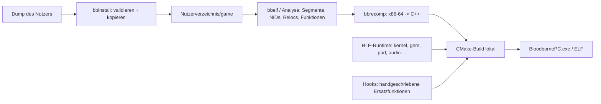

# Architektur

Ziel: nativer PC-Port von Bloodborne 1.09 (+ The Old Hunters). Der `eboot.bin` des Nutzers wird **lokal** statisch
nach C++ rekompiliert; alle PS4-Systembibliotheken werden durch Host-Implementierungen (HLE) ersetzt.
Vorbild: [Dusklight](https://github.com/TwilitRealm/dusklight) (Decomp + Aurora-Kompatibilitätsschicht);
Rekompilierungs-Konzepte aus [N64Recomp](https://github.com/N64Recomp/N64Recomp) und
[XenonRecomp](https://github.com/hedge-dev/XenonRecomp); HLE- und GCN-Wissen aus
[shadPS4](https://github.com/shadps4-emu/shadPS4).

## Lizenz

**GPL-3.0-or-later.** Begründung: shadPS4 (GPL-2.0-or-later) ist die mit Abstand wertvollste Code-Referenz
(HLE, PM4, GCN→SPIR-V). Unter GPLv3 dürfen wir Code daraus übernehmen. MIT wäre für Nutzer freizügiger, würde aber jede
Übernahme aus shadPS4 ausschließen. MIT- und Apache-2.0-Abhängigkeiten (N64Recomp, XenonRecomp, LibAtrac9, SDL3, Remill,
[Zydis](https://github.com/zyantific/zydis) – bereits eingebunden, v4.1.1 per CMake FetchContent) sind GPLv3-kompatibel.

## Datenfluss



## Verzeichnisstruktur

`[x]` = existiert, `[ ]` = geplant (entsteht mit dem jeweiligen Meilenstein, nicht vorher).

```
BloodbornePC/
├── CMakeLists.txt                 [x]
├── LICENSE                        [x] GPL-3.0
├── .github/workflows/ci.yml       [x] Windows (MSVC) + Linux (Clang)
├── docs/                          [x] Architektur, Roadmap
├── manifests/                     [x] SHA-256-Manifeste (nur Hashes, keine Inhalte)
├── src/
│   ├── core/                      [x] gemeinsame Bibliothek bbcore
│   │   ├── hash.*                     SHA-1 (NIDs), SHA-256 (Validierung)
│   │   ├── nid.*                      NID-Erzeugung/-Decodierung
│   │   ├── sfo.*                      PARAM.SFO
│   │   ├── orbis_elf.*                ELF/fSELF: Segmente, Dynamic, Module, Libs, Symbole, Relocs
│   │   └── dump.*                     Struktur-/Hash-Prüfung, Installationspfad
│   ├── recomp/                    [ ] M0/M1: Disassembler-Anbindung, Funktionsfinder, C++-Emitter
│   ├── runtime/                   [ ] M1: Gast-Speicher, CPU-Kontext, TLS, Loader für rekompilierten Code
│   ├── hle/                       [ ] M1+: eine Datei pro PS4-Bibliothek
│   │   ├── kernel/                    Threads, Sync, Speicher, Zeit, Dateisystem (/app0 → game/)
│   │   ├── gnm/  videoout/            M2: Vulkan-Backend
│   │   ├── pad/  audio/  ajm/         M3: SDL3, LibAtrac9
│   │   └── savedata/ trophy/ user/ np/
│   ├── renderer/                  [ ] M2: Vulkan, GCN→SPIR-V, Pipeline-Cache, Detiling
│   ├── hooks/                     [ ] M1+: handgeschriebene Ersatzfunktionen (Frame-Timing, Kamera, HUD)
│   └── app/                       [ ] M1: main, Config, ImGui-Overlay
├── tools/
│   ├── bbinstall/                 [x] validate | hash | install
│   ├── bbelf/                     [x] ELF-Analyse
│   ├── bbrecomp/                  [ ] M1
│   └── ghidra/                    [ ] M0: Headless-Skripte (Import der bbelf-CSV, Funktionslisten)
├── tests/                         [x] synthetische Fixtures, Known-Answer-Tests
└── build/ (gitignored)                generierter Code landet in build/generated, nie im Repo
```

## Komponenten

### Installer (`bbinstall`)
- Eingabe: **entpackter** Anwendungsordner mit eingespieltem Update 1.09 (`eboot.bin`, `sce_sys/param.sfo`,
  `dvdroot_ps4/`), optional DLC-Ordner.
- Prüfungen: `param.sfo` (TITLE_ID ∈ bekannte Bloodborne-IDs, `CATEGORY` `gd` oder `gp` (zusammengeführter Dump trägt
  die SFO des Updates), `APP_VER=01.09`), `eboot.bin` ist ELF oder unverschlüsseltes fSELF, Datenordner (nur Warnung,
  Layout unbestätigt), DLC `CATEGORY=ac` mit passender TITLE_ID, optional SHA-256-Manifest (maßgeblich für
  Vollständigkeit).
- **PKG-Eingabe wird abgelehnt.** Der PFS-Inhalt eines PS4-PKG ist verschlüsselt; ihn zu öffnen erfordert Schlüssel
  bzw. Entschlüsselung. Beides schließen die Projektregeln aus. Der Nutzer entpackt sein PKG mit einem externen Werkzeug
  seiner Wahl.
- Zielverzeichnis: `%APPDATA%\BloodbornePC` bzw. `$XDG_DATA_HOME/BloodbornePC`; Unterordner `game/`, `dlc/`, `mods/`
  (Override-Ordner mit derselben Struktur wie `game/`).

### Code-Pipeline
Host und Gast sind beide x86-64. Daraus ergeben sich drei Optionen:

| Option | Pro | Contra |
|---|---|---|
| **A: x86-64 → C++ (XenonRecomp-Stil)** | portabel, debugbar, Hooks trivial (Funktion = C++-Funktion) | riesige Codemenge (Kompilierzeit), Flags/SIMD müssen exakt nachgebildet werden |
| B: Lifting nach LLVM IR (Remill) | ausgereifte Semantik, LLVM optimiert | Remill-IR ist schwer lesbar, Hooks/Debugging mühsamer, große Abhängigkeit |
| C: Originalcode nativ laden und patchen (shadPS4-Weg) | schnellster Weg zum Boot | genau der Emulator-/Loader-Ansatz, den das Projekt ausschließt; `fs`-TLS und SysV-ABI kollidieren unter Windows |

**Entscheidung: A**, mit Remill (B) als Referenz für die Semantik schwieriger Befehle. Kern des Designs:
- Gast-Zustand liegt in einem `Context`-Struct (16 GPRs, RFLAGS-Bits, 16 YMM, `fs_base`). Jede Gast-Funktion wird zu
  `void f_<vaddr>(Context&)`. Damit spielt die SysV/MS-ABI-Frage im Spielcode keine Rolle; nur
  HLE-Grenzen übersetzen zwischen `Context` und C++-Signaturen (Codegenerator, nicht Laufzeit-Thunks).
- Gastadressen bleiben gültig: Gastadresse = Link-vaddr + Load-Bias (`kLoadBias`, beim Rekompilieren fest; das eboot
  ist bei vaddr 0 gelinkt und bekommt `0x400000`, wie auf der PS4 und in den Community-Patches). Geplant ist
  Identity-Mapping: Der Gast-Adressraum wird an denselben Host-Adressen reserviert (`Context::base = 0`), sodass
  Gastzeiger direkt Hostzeiger sind. `fs:`-Zugriffe übersetzt der Emitter bereits zu `c.fs_base + …`; das TLS-Setup
  (`fs_base` je Thread auf den TCB) ist noch offen (M1.2).
- Indirekte Sprünge/Aufrufe gehen über eine Lookup-Tabelle vaddr → Funktion; Sprungtabellen werden statisch aufgelöst.
- Imports (`JUMP_SLOT`/`GLOB_DAT` aus `bbelf`) werden direkt mit HLE-Funktionen verbunden.
- Hooks: Eine Tabelle vaddr → handgeschriebene Funktion ersetzt die generierte Funktion beim Codegen.

### HLE / Renderer
Siehe Roadmap. Der Renderer fängt auf **Gnm-Ebene** (`sceGnmSubmitCommandBuffers`, `sceGnmDraw*`, …) ab und parst die
PM4-Pakete der Command Buffer selbst. Die Gnm-Treiberbibliothek schreibt nur PM4, deshalb gibt es keinen
„generischen Command-Processor“ im Emulator-Sinn. Shader: GCN-Bytecode → SPIR-V (Konzept und Code-Basis aus
shadPS4s `shader_recompiler`), persistenter Pipeline-Cache.

## Bekanntes Wissen über Bloodborne 1.09 (aus Community-Patches)
Quelle: [illusion0001/console-game-patches, Bloodborne-Orbis.yml](https://github.com/illusion0001/console-game-patches/blob/main/_patch0/orbis/Bloodborne-Orbis.yml)
(60-FPS-Diff nach [Lance McDonald](https://www.patreon.com/posts/47314774)).
- Title-IDs mit 1.09: CUSA00900 (US), CUSA00207 (EU), CUSA03173, CUSA00208, CUSA01363.
- Frame-Zeit-Konstante 1/30 s bei `0x02434883` (Patch setzt 1/60); Flip-Rate über `sceVideoOutSetFlipRate` nahe `0x02ad61df`.
- Global bei `0x059404f8`, Feld `+0x264`: laut Patch eine Physik-Deltatime, die an mehreren Stellen
  (`0x01bf9ca9`, `0x021bc181`, `0x02377cec`, `0x02418e3d`) in Spiellogik übernommen wird. Das sind direkte Startpunkte
  für M5 (Frame-Unlock).
- Render-Target-Größe als Daten bei `0x055289f8/…fc` (1920×1080); Fadenkreuz-Skalierung hart auf 1920×1080 bei
  `0x01a44c55`, `0x01a452c7`.
- Chromatische Aberration `0x0269faa8`, Motion Blur `0x026a057b`.
Die Adressen sind **vaddr + `0x400000`** (Ladebasis, die GoldHEN/shadPS4 für das eboot verwenden). Belegt am echten
eboot: Bei Patch-Adresse `0x055289f8` − `0x400000` stehen die Werte 1920 und 1080. Die Code-Adressen sind noch nicht
gegen 1.09 geprüft, weil der bisher vorliegende Dump Version 1.00 ist.

## Befunde am echten eboot (CUSA03173, v01.00, PKG-Entpacker-Layout)
Mit `bbelf` ermittelt, Rohdaten nur lokal in `build/`.
- Format: unverschlüsseltes fSELF, Typ `ET_SCE_DYNEXEC`, Image ab vaddr 0 (positionsunabhängig), Entry `0xa0`, SDK
  `0x02000071`. Original-Dateiname `SPRJ_ps4_Master_LTO.elf`: Projektcode SPRJ, LTO-Build.
- Ausführbares Segment 0x50da034 Bytes: Code `0xa0`–`0x2bbe9a5` (≈ 44 MiB, 176.895 Funktionen: 162.959 mit FDE, 13.936 ohne),
  danach PLT (661 Slots) und Nur-Lese-Daten (≈ 37 MiB, keine Funktionsprologe). Daten/BSS bis 0x56d30b4,
  `PT_TLS` 0x750 Bytes.
- 42 benötigte Module, 701 Imports, alle über die NID-Tabelle aufgelöst (`tools/nidnames.py`). Der NID-Algorithmus
  stimmt mit 59.278 von 59.307 öffentlichen Paaren überein; die 29 Ausnahmen sind bereinigte Namen mit Leerzeichen.
- Imports je Bibliothek (Top): libc 216, libkernel 80 (+ libScePosix 32), libSceGnmDriver 50, libSceNet 35,
  NpMatching2 27, Http 24, NpManager 20, NpWebApi 17, Fios2 17, AvPlayer 16 (Cutscenes), Ajm 12, SaveData 11, Pad 9,
  VideoOut 8, AudioOut 6.
- Relocations: 234.990, davon 231.468 `RELATIVE`, 2.838 `R_X86_64_64`, 661 `JUMP_SLOT`, 23 `GLOB_DAT`.
- `sce_module/` enthält `libc.prx`, `libSceFios2.prx` sowie Face/Hand/HeadTracker/S3DConversion/Smart.
  libc ist also eine eigene PRX und wird durch Host-libc-Wrapper ersetzt.
- Befehlszählung (`bbrecomp --stats`, alle 176.895 Funktionen linear dekodiert, daher inkl. als Code gelesener
  Tabellendaten/Padding – Werte näherungsweise): 10.690.870 Befehle, 400 verschiedene
  Mnemonics. 24 davon decken 90 % ab, 104 decken 99 %, 199 decken 99,9 %, 272 decken 99,99 %. ISA: I86 86,5 %,
  AVX (VEX-kodiert) 9,6 %, CMOV 0,3 %, BMI1/LZCNT/POPCNT/MOVBE vereinzelt, x87 2.376 Befehle.
  Kein `syscall` im eboot (alles über libkernel-Imports), 17.122 `fs:`-Zugriffe (TLS). Konsequenz für den Emitter:
  zuerst der Integer-Kern (mov/lea/call/cmp/test/push/pop/jcc/add/xor/ret…), dann AVX über `<immintrin.h>`
  (Host ist ebenfalls x86-64), x87 zuletzt.

## Annahmen
1. ✅ Spieldaten liegen lose unter `dvdroot_ps4/` (action, chr, event, facegen, map, menu, movie, msg, mtd, obj, other,
   param, paramdef, parts, remo, script, sfx, shader, sound).
2. ❓ Ob der DLC eigene Daten enthält oder nur ein Freischalt-Eintrag ist, ist unbekannt. Ein DLC-Dump zeigt es.
   CUSA03173 ist möglicherweise eine Edition mit enthaltenem DLC (unbelegt).
3. ✅ `ET_SCE_DYNEXEC`, aber **nicht** mit fester Basis: Das Image beginnt bei vaddr 0. Die Runtime mappt es an einer
   gewählten Basis (`0x400000` passt zu den Patch-Adressen) und wendet die `RELATIVE`-Relocs an.
